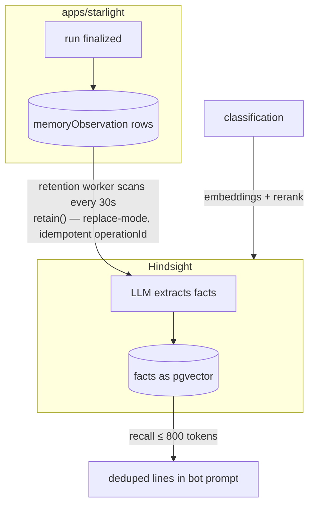

## Starlight

Telegram bot that turns liked tweets into a searchable, self-hosted media library — collect, classify, and browse Twitter images with AI.

```text
Telegram ─▶ apps/starlight (bot)          user chat, AI conversations, media intake
                │
                ▼
            apps/server (worker)           scrapes liked tweets, stores images to S3
                ├─▶ classification (ML)    CLIP tagging, pHash dedup, embeddings
                ▼
            PostgreSQL ◀── apps/web        TanStack Start UI to browse and search
```

### Layers

Each service has an `.env.example`; copy it to `.env` and fill in the secrets.

- **`apps/starlight`** — the Telegram bot users talk to, with AI conversations backed by long-term memory.
- **`apps/server`** — worker that scrapes liked tweets, uploads images to S3, and enqueues BullMQ jobs over Valkey.
- **`classification`** — Python FastAPI service wrapping CLIP, pHash dedup, and embedding/rerank models.
- **`apps/web`** — TanStack Start UI to browse and search the library by tags and embeddings.
- **`hindsight`** — prebuilt memory service powering the bot's conversations.

Run any TypeScript app with `bun dev`; classification installs with `uv sync`.

### How memory works



One memory namespace per conversation (`assistantId:chatId:threadKey`). Raw transcripts are never stored by Hindsight — the bot's PostgreSQL remains the source of truth.

The ML layer is optional: `classification` is a replaceable implementation of OpenAI-shaped embeddings and Cohere-shaped rerank, so any compatible service works. Non-secret Hindsight settings are inline in `docker-compose.yaml`; the root `.env` only holds compose-wide secrets.

### Deployment

Copy `.env.example` files and generate secrets (`openssl rand -hex 32`). In a git clone, install hooks once with `bunx lefthook install`.

```bash
# Apply reviewed migrations once, then start services
docker compose --env-file .env --profile operations run --rm migrate
docker compose --env-file .env up -d
```

Alternative deployment: Dokploy, Fly.io, Railway, or manual Docker.

### License

MIT
